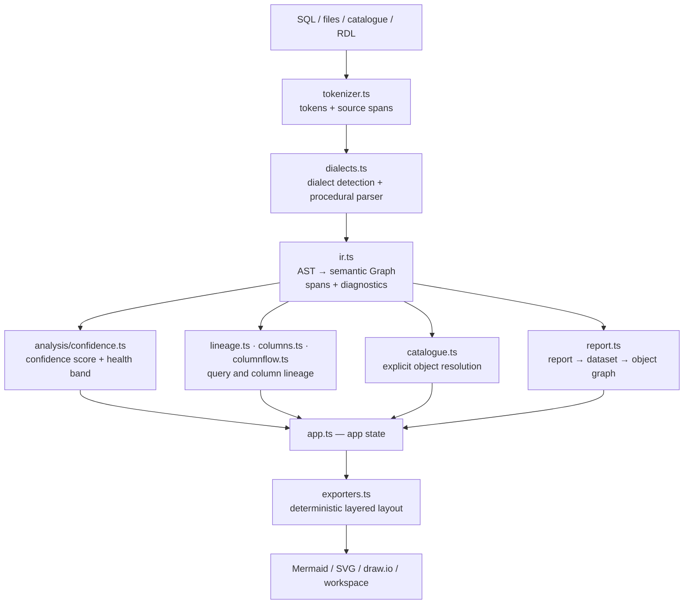
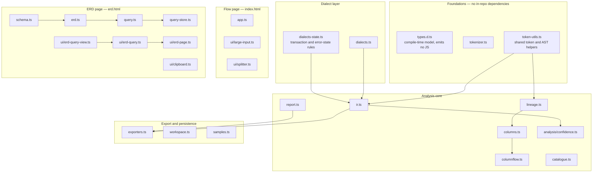
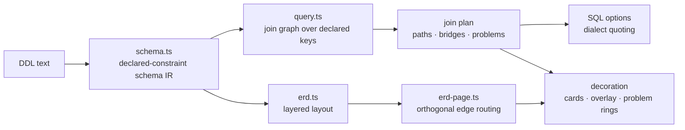

# Architecture

SQL Cartographer is a static browser application. The runtime is a set of ordered
classic scripts compiled from TypeScript with `module: none`; the browser does
not need a backend, package manager, or database connection.

## Pipeline



Analysis is one-directional: tokens become an AST, the AST becomes a semantic
`Graph` whose nodes and edges carry source spans and diagnostics, and every
exporter reads that graph without mutating it. Nothing runs backwards — an
exporter never feeds state into analysis, and a presentation filter never
rewrites an analysis count.

## Module boundaries

Scripts are globals loaded in a fixed order, so **load order is the dependency
contract**. A module may only call modules listed above it in the load lists in
`index.html` and `erd.html`; the two pages share a common foundation.



- `src/tokenizer.ts` — tokenisation and source positions.
- `src/token-utils.ts` — shared token and AST helpers (`walkAst`, span
  assembly, Mermaid escaping, name de-duplication). Extracted from `ir.ts`.
- `src/types.d.ts` — the shared compile-time model for every script. It emits no
  JavaScript; it is the single place the graph, diagnostic, and IR vocabulary is
  spelled out.
- `src/dialects.ts` — dialect detection and parser selection.
- `src/dialects-state.ts` — T-SQL transaction-depth and PL/pgSQL / DB2
  error-state rules, as pure predicates over the AST. Extracted from `ir.ts`.
- `src/ir.ts` — AST, analysis, attribution, and semantic graph construction.
- `src/analysis/confidence.ts` — confidence scoring and health bands.
- `src/lineage.ts`, `src/columns.ts`, and `src/columnflow.ts` — query and
  column lineage. These form a one-way chain over `token-utils` with no cycles.
- `src/catalogue.ts` — explicit catalogue resolution.
- `src/report.ts` — report/dataset import and graph construction.
- `src/exporters.ts` — graph layout, Mermaid, SVG, draw.io, and narration.
- `src/workspace.ts` — opt-in browser persistence (workspace snapshot, ERD
  layout, and saved query) plus presentation filters. The only module permitted
  to touch `localStorage`.
- `src/samples.ts` — the bundled demo SQL loaded by **Load sample**.
- `src/schema.ts` and `src/erd.ts` — declared-constraint schema IR, ERD layout,
  and layout files for the ERD page.
- `src/query.ts` — ERD query builder: join-graph pathfinding over declared
  foreign keys, aggregates/GROUP BY, and dialect-quoted SQL emission.
- `src/query-store.ts` — pure, versioned query files and saved-query
  serialization with schema-fingerprint pruning.
- `src/ui/erd-page.ts` — ERD interaction: entity cards, inspector, layout
  application and pinning, zoom, orthogonal edge routing, and event wiring. It
  consumes the decoration contract (`erdQueryPanelState`) to draw checkboxes,
  plan highlights, and problem rings.
- `src/ui/erd-query.ts` — query-builder panel state, events, teaching, and the
  floating SQL window. It owns no DOM builders.
- `src/ui/erd-query-view.ts` — query-builder view builders. Pure DOM functions
  that hold no state and attach no listeners.
- `src/ui/clipboard.ts`, `src/ui/splitter.ts`, and `src/ui/large-input.ts` —
  shared browser helpers: copy, the resizable pane divider, and the
  large-input responsiveness policy.
- `src/app.ts` — the flow page controller: editor, gutter, stats, catalogue and
  report management, Mermaid rendering, and menus.

### Graph vocabulary

Every exported diagram speaks the same two vocabularies. They are the contract
that the live UI, the Mermaid export, and the draw.io export must all honour.

| | Values | Meaning |
| --- | --- | --- |
| **Node provenance** | `source`, `external`, `synthetic` | Parsed from this input / referenced but not defined here / derived by SQL Cartographer |
| **Edge kind** | `control`, `exception`, `data`, `dependency`, `call` | Modelled execution order / transfer to a handler / proven producer→consumer / object read or reference / identified invocation |

See [V2 accuracy contract](V2_ACCURACY_CONTRACT.md) for what each kind does and
does not assert.

## The ERD pipeline



## The query builder

The ERD query builder follows declared foreign-key evidence only. Picked
columns that the declared graph cannot connect become explicit problems with
three resolutions: teach the join by hand (labelled "not declared" in the plan
and SQL), opt into a CROSS JOIN, or leave the columns out. It never silently
produces a cartesian product, and it never drops a pick from the SQL without
naming it in the provenance comment. See
[QUERY_BUILDER.md](QUERY_BUILDER.md) and
[ADR-001](decisions/ADR-001-declared-evidence-query-builder.md).

```text
DDL -> schema IR -> query join graph -> join plan (paths, bridges, problems)
                                            |-> SQL options -> dialect SQL
                                            |-> decoration -> cards / overlay
```

`src/query.ts` is pure and DOM-free: graph construction, shortest-path
selection, plan building, SQL emission, and the highlighting tokenizer.
`src/ui/erd-query.ts` owns the panel state and events; `src/ui/erd-page.ts`
consumes the decoration contract (`erdQueryPanelState`) to draw checkboxes,
plan highlights, and problem rings.

## Design invariants

1. Source spans travel with analysis results so findings can be inspected.
2. Unknown, dynamic, ambiguous, and unresolved constructs remain explicit.
3. Presentation filters do not mutate analysis counts or semantic edges.
4. Export ordering and layout are deterministic for the documented graph
   classes.
5. Persistence is opt-in and local to the browser.
6. Query-builder joins use declared foreign-key evidence only; unjoinable picks
   stay explicit, and a cartesian product is never silent.
7. Saved queries are explicit, versioned, and schema-fingerprinted; stale state
   is pruned and reported, never silently applied.

The layout implementation uses bounded, deterministic placement and an
iterative graph traversal for cycle detection, avoiding a call-stack limit for
large linear or cyclic graphs. Layout is a usability guarantee for the tested
graph classes, not a claim that every arbitrary graph has crossing-free edges.

There are two independent layered-layout implementations, one per page:
`src/exporters.ts` lays out the analysis `Graph`, and `src/erd.ts` lays out the
schema graph. They solve the same class of problem on different node models and
are kept separate deliberately — merging them would force one page's geometry
assumptions onto the other.

## Where to read next

| Question | Read |
| --- | --- |
| How is the plan chosen? | [QUERY_BUILDER.md](QUERY_BUILDER.md), [ADR-001](decisions/ADR-001-declared-evidence-query-builder.md) |
| What is guaranteed? | [V2 accuracy contract](V2_ACCURACY_CONTRACT.md), [ACCURACY.md](ACCURACY.md) |
| How do I build and test? | [DEVELOPMENT.md](DEVELOPMENT.md) |
| Why a decision? | [ADR-001](decisions/ADR-001-declared-evidence-query-builder.md) · [ADR-002](decisions/ADR-002-query-persistence.md) · [ADR-003](decisions/ADR-003-aggregates-derive-group-by.md) |
