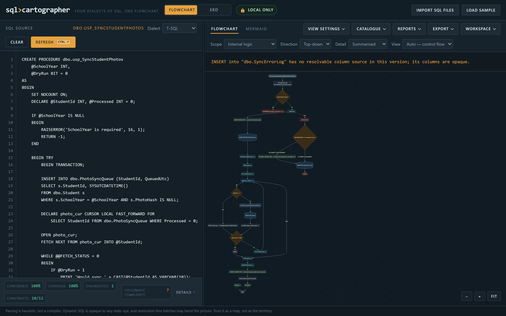
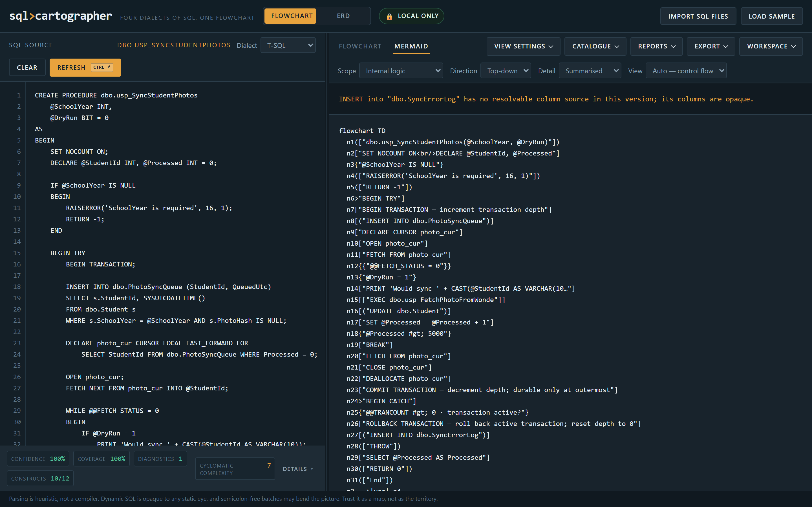
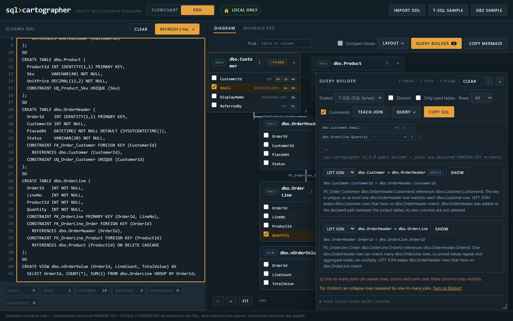
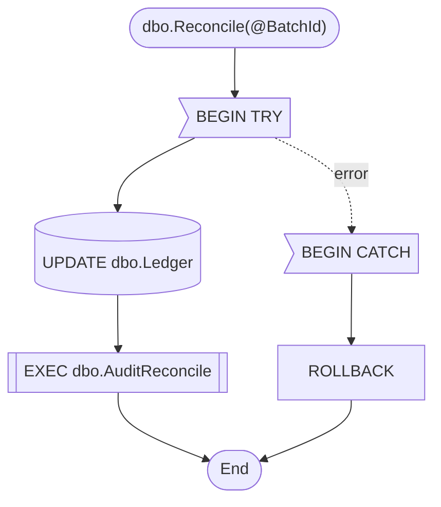
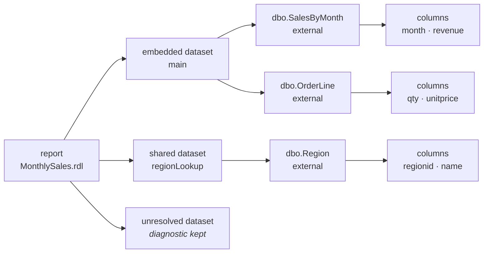

# SQL Cartographer user guide

SQL Cartographer is a local-first investigation aid for SQL control flow and object
dependencies. It accepts pasted SQL, a folder of SQL files, a catalogue, or an
SSRS/RDL report definition and renders an explorable diagram.

## Contents

- [First run](#first-run)
- [Your first five minutes](#your-first-five-minutes)
- [Reading the diagram](#reading-the-diagram)
  - [Node provenance](#node-provenance)
  - [Edge kind](#edge-kind)
  - [Traceability](#traceability)
- [Main workflows](#main-workflows)
  - [Database review](#database-review)
  - [ERD query builder](#erd-query-builder)
  - [Report and dataset review](#report-and-dataset-review)
  - [Catalogue-assisted resolution](#catalogue-assisted-resolution)
  - [Large inputs](#large-inputs)
  - [Workspace and filters](#workspace-and-filters)
- [Exports](#exports)
- [Troubleshooting](#troubleshooting)

## First run

1. Download the v3.1.0 runtime ZIP from the repository release, or clone the
   repository for development.
2. Open `index.html` in a current Chromium, Firefox, or Edge browser. The
   runtime does not require a server or a database connection.
3. Paste SQL, choose **Auto** or a dialect, and select **Refresh**.
4. Use the **Object**, **Scope**, and **Direction** controls to focus the
   diagram. The source and diagnostics panels remain the authority for review.

For a repeatable local server, run `python -m http.server 8000` in the runtime
directory and open `http://127.0.0.1:8000/`.

The fastest way to see what the tool does is **Load sample**, which pastes a
bundled demo procedure and analyses it. Then use the **Object**, **Scope**, and
**Direction** controls to move around the result.

## Your first five minutes

A tour of one click each. No input to prepare.

1. **Load sample.** Open `index.html`, leave the dialect on **Auto**, and press
   **Load sample**. A representative T-SQL procedure appears and is analysed
   immediately.

2. **Read the health strip first.** Along the bottom: confidence, coverage,
   diagnostics, and cyclomatic complexity. Coverage is the percentage of body
   tokens the parser consumed — if it is not 100%, find out why before trusting
   the picture.

   

3. **Switch scope.** The **Scope** control moves between **Internal logic**,
   **Query structure**, and **Object dependencies**. They answer different
   questions about the same input: what order can this run in, what does it
   read and write, and what does it call. The **View** control narrows further
   to control flow or query flow.

4. **Check a fact against the source.** Click a node. The source panel selects
   the exact characters that produced it. If you cannot find the evidence in
   the source panel, do not rely on the edge.

5. **Export.** **Copy Mermaid** gives the deterministic definition, **Save SVG**
   the rendered diagram, **Save draw.io** editable XML with provenance metadata.
   Switch to the **Mermaid** tab to see the definition before you copy it.

   

6. **Try the ERD.** Open `erd.html` and press **T-SQL sample**. Declared
   `PRIMARY KEY`, `UNIQUE`, and `FOREIGN KEY` constraints become entity cards
   with key badges, joined by orthogonally routed lines.

7. **Build a query.** Press **Query builder**, tick `Email` on `dbo.Customer`
   and `Quantity` on `dbo.OrderLine`. Nothing declares those two tables to each
   other, so the plan bridges through `dbo.OrderHeader` — joined and tagged,
   its own columns never selected. The window explains every join in plain
   language and warns that one-to-many joins can multiply rows.

   

That is the whole loop: load, read the health strip, switch scope, verify
against source, export. Everything else in this guide is a variation on it.

## Reading the diagram

Every shape and line in a SQL Cartographer diagram carries meaning. Two
vocabularies run through the whole product — the live UI, the Mermaid export,
and the draw.io export all speak them.

### Node provenance

| Shape | Provenance | Meaning |
| --- | --- | --- |
| Solid | `source` | Parsed from the SQL you supplied |
| Dashed | `external` | Referenced but not defined here; the full name is kept |
| Dotted | `synthetic` | Derived by SQL Cartographer (a loop head, an exit, a merge point); its origin is declared |

### Edge kind

An edge asserts exactly one thing and refuses to assert more. Its kind is
carried through every export — in the live UI as line style, in Mermaid as the
edge form and label, in draw.io as the edge style and provenance attribute.

| Kind | Where you see it | It asserts | It does not assert |
| --- | --- | --- | --- |
| `control` | control-flow scope | a statically modelled possible execution order | that every runtime path takes it |
| `exception` | control-flow scope, into a handler | transfer to a compatible statically modelled handler | every database runtime error outcome |
| `call` | a procedure, function, or `EXEC` step | a statically identified invocation | a dynamic statement name or prepared statement |
| `dependency` | query structure and object dependencies | a statically identified object read or reference | an unverified external identity |
| `data` | query structure and column flow | a unique, conservatively proven producer → consumer definition | flow across ambiguous branch or loop definitions |

A worked example. This procedure is the input:

```sql
CREATE PROCEDURE dbo.Reconcile @BatchId int
AS
BEGIN
    BEGIN TRY
        UPDATE dbo.Ledger SET Posted = 1 WHERE BatchId = @BatchId;
        EXEC dbo.AuditReconcile @BatchId;
    END TRY
    BEGIN CATCH
        ROLLBACK;
    END CATCH
END
```

**Control flow** scope renders this. The shape of a node is its class, and
every class has a provenance:



Read it against the two vocabularies:

- `n1`, `n2`, `n5`, `n7` are **synthetic** — SQL Cartographer derived them from
  the control structure. The procedure entry, the `try` and `catch` region
  heads, and the exit are not statements you wrote.
- `n3`, `n4`, `n6` are **source** — each maps back to the exact characters of
  the `UPDATE`, the `EXEC`, and the `ROLLBACK`.
- `n2 → n3` is a **control** edge: a statically modelled possible execution
  order. It does not claim every runtime path takes it.
- `n2 -.->|error| n5` is an **exception** edge: transfer to a compatible
  modelled handler. It does not claim every database error outcome.
- `n4 → n7` is a **call** edge: `dbo.AuditReconcile` is a statically identified
  invocation.

Nothing in this diagram claims that `dbo.Ledger` or `dbo.AuditReconcile` exists,
or what they contain. Their DDL is not in this input. Switch to **Query
structure** and those appear as **external** identities — referenced, not
defined here.

### Traceability

The exported Mermaid carries the same facts as a provenance comment, so a
copied diagram never loses where a shape came from. This is the real tail of
the export for the procedure above:

```text
%% sql-cartographer provenance
%% n1:start provenance=synthetic reason=diagram entry
%% n2:try provenance=synthetic reason=exception-protected region entry
%% n3:io provenance=source span=75-132
%% n4:call provenance=source span=142-174
%% n5:catch provenance=synthetic reason=exception handler entry
%% n6:tran provenance=source span=212-220
%% n7:start provenance=synthetic reason=diagram exit
```

Those spans are half-open character ranges into your input. Click a node in the
source panel and the editor selects exactly those characters — which is why the
source panel, not the diagram, is the authority for review.

## Main workflows

### Database review

Paste or import a procedure, function, trigger, view, or multi-object script.
Start with **Control flow** to inspect decisions, loops, transactions, exits,
cursor operations, and exception paths. Switch to **Query structure** to see
reads, writes, joins, CTEs, subqueries, and result sets. For a multi-object
script, **Object dependencies** shows calls and table relationships.

Use the source span selection and diagnostics before relying on a relationship
in a change review. Dynamic SQL is deliberately shown as an opaque step.

### ERD query builder

On `erd.html`, choose **Query builder** to pick columns directly on the table
cards. Every card shows a checkbox per column, and a floating window (drag its
header to move it, drag the corner grip to resize it, arrow keys work on the
grip) shows the generated SQL. The window controls:

- **Dialect**, **Distinct**, a row cap, and **Comments** for the provenance
  header. The SQL is marked up with syntax colours and **Copy SQL** copies the
  exact text.
- **Join plan** cards for each join the declared foreign keys imply, with an
  INNER/LEFT switch and a sentence explaining direction, optionality, and row
  multiplication. Bridge tables are tagged; hovering a join card highlights
  the exact edge and both endpoint cards.
- **Problems** for tables no declared path reaches. SQL Cartographer never silently
  cross-joins: teach the join with the column pair (or a typed predicate),
  opt into a CROSS JOIN, or leave the table's columns out. The SQL header lists
  anything left out.
- **Teach join** (toolbar or a problem card) defines a join by clicking two
  columns on the diagram. Clicking two columns of the same table creates a
  self join with a second alias; tick which picked columns should read from
  that second copy.

Picked-column chips at the top of the window cycle through ascending and
descending sorts (the arrow button), reveal the table on the diagram, and
remove the pick. Each chip also has an aggregate selector — **COUNT**,
**COUNT DISTINCT**, **SUM**, **AVG**, **MIN**, **MAX** — and every remaining
picked column becomes the `GROUP BY` list. **Only used tables** narrows the
canvas to the query's tables plus any that need a resolution. Query mode dims
edges outside the plan, suspends compact boxes, and hides the selection
inspector while you build. Press **Q** to toggle query mode from the keyboard,
and Escape to cancel teaching.

The **Query** menu keeps the work. **Save to this browser** / **Restore saved**
/ **Forget saved** store one query locally, and nothing is stored until you
choose Save. **Export query file** and **Import query file** move a versioned
JSON file, and **Download .sql** writes the statement as a file. Restoring
prunes references that no longer exist and reports what it dropped; a changed
schema never blocks a restore.

Full semantics — join policy, taught and self joins, SQL options, and what the
builder never does — are in [Query builder](QUERY_BUILDER.md).

### Report and dataset review

Open **Reports**, paste or import an `.rdl`/`.xml` report, and choose **Apply
report**. Embedded dataset queries are analysed; shared and unresolved datasets
remain explicit with diagnostics. Choose a dataset to inspect its SQL. The
**Report dependencies** scope shows the report → dataset → object → column
chain.



Only the embedded dataset contributes analysed SQL. The shared dataset is
analysed as its own object; the unresolved one stays visible with a diagnostic
rather than being guessed at.

### Catalogue-assisted resolution

Open **Catalogue** and paste JSON or the supported line format, then choose
**Apply catalogue**. Exact full-name matches and explicit synonyms can verify
object identity. Partial, conflicting, or ambiguous matches remain external
and receive a diagnostic rather than being silently guessed.

### Large inputs

Inputs at or above 100,000 characters show a notice and pause automatic
re-analysis while editing. This keeps typing responsive. Select **Refresh** to
analyse the current text explicitly. The threshold is a responsiveness guard,
not a parser truncation limit; source text and coverage are preserved.

### Workspace and filters

Workspace save is opt-in. **Save to this browser** stores the current files,
options, catalogue, and report in local browser storage. **Export workspace
file** creates a portable JSON snapshot; **Import workspace file** restores it.
Dependency filters change presentation only and do not rewrite analysis counts.
Older supported workspaces migrate deterministically. A workspace from a newer
SQL Cartographer schema is not imported or changed; upgrade SQL Cartographer to open it.

## Exports

- **Copy Mermaid** copies the deterministic Mermaid definition.
- **Save SVG** saves the rendered diagram.
- **Save draw.io** saves editable XML with source and provenance metadata.
- **Copy narration prompt** creates a text prompt describing the diagram.

Treat exported diagrams as review artifacts. Keep the source SQL with them and
record the SQL Cartographer version used.

## Troubleshooting

- If automatic dialect detection is uncertain, select the dialect manually and
  inspect the `dialect_ambiguous` diagnostic.
- If coverage is incomplete, review the unresolved span before accepting any
  conclusion.
- If a diagram is unexpectedly sparse, check for dynamic SQL, unsupported
  vendor syntax, or a missing catalogue/report input.
- If an import fails, use the diagnostics and the minimal anonymised fixture
  when reporting the issue; do not attach confidential SQL.

See [Accuracy](ACCURACY.md), [Security](SECURITY.md), and [Development](DEVELOPMENT.md)
for the limits and verification contract.


